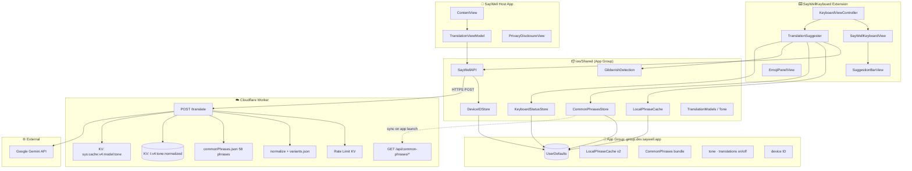
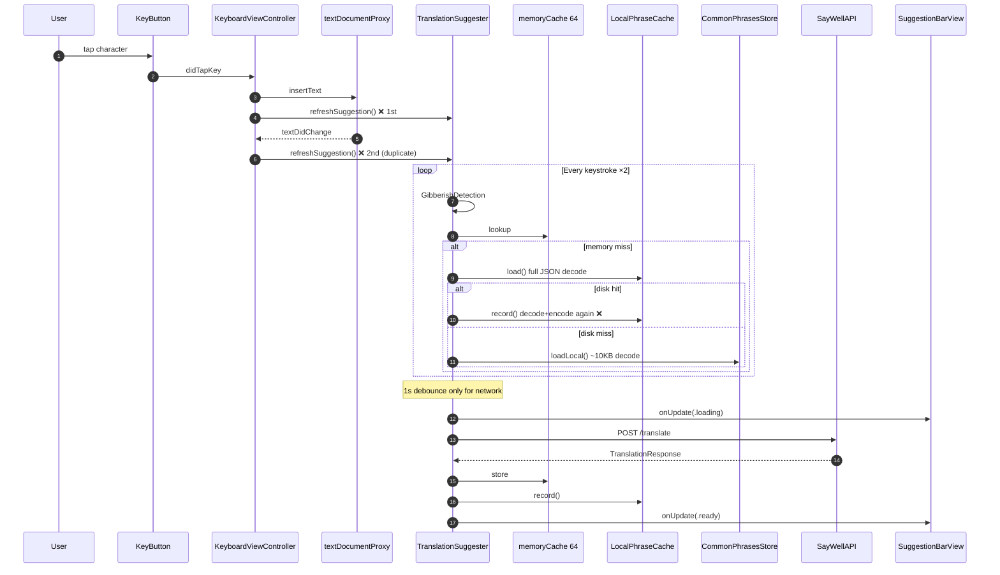
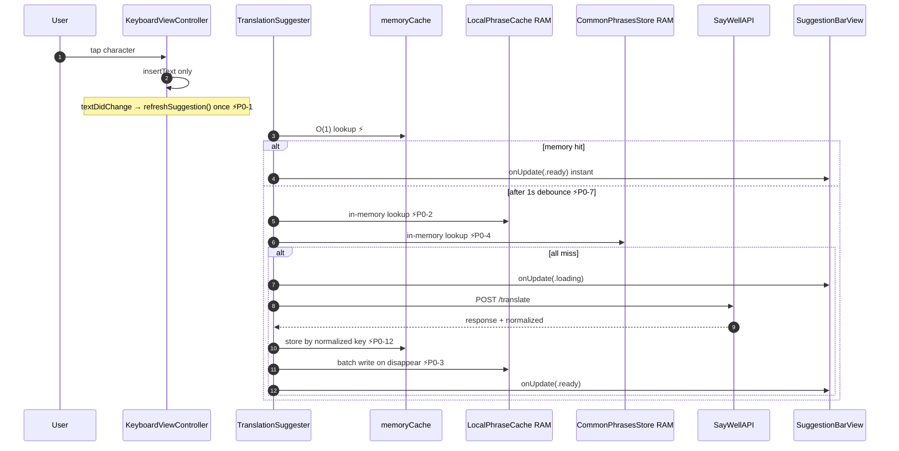
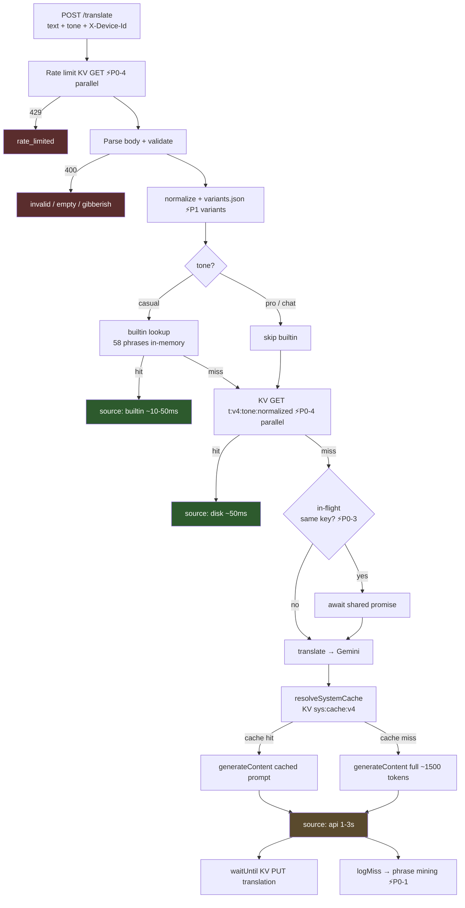
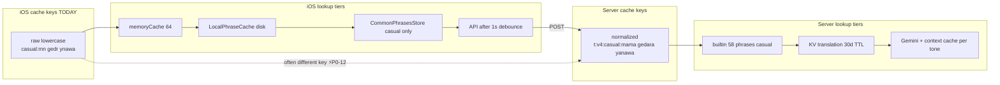
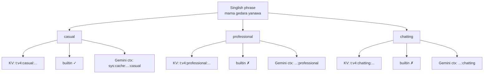

# SayWell — Architecture & Performance

> System overview, request pipelines, cache layers, and **P0** performance improvements.
> Last updated: Jul 23, 2026.

See also: [PROJECT_LOG.md](PROJECT_LOG.md) (current state) · [FUTURE_PLANS.md](FUTURE_PLANS.md) (roadmap)

---

## 1. System overview

### Repos & deployment

| Component | Path | Remote |
|-----------|------|--------|
| iOS app + keyboard | `ios/` | [sooriyo/SayWell](https://github.com/sooriyo/SayWell) |
| Cloudflare Worker | `backend/` | [sooriyo/saywell-backend](https://github.com/sooriyo/saywell-backend) |
| Live API | — | `https://saywell-backend.saywell.workers.dev` |

---

## 2. iOS — typing → translation flow (today)

**Pain points:** double refresh per keystroke, disk I/O on every character (not debounced), write-on-read in `LocalPhraseCache`, full keyboard `rebuildKeys()` after each shifted letter.

---

## 3. iOS — P0 target flow (after fixes)

---

## 4. Backend — `/translate` pipeline

### Latency by path

| Path | Typical latency | Cost |
|------|-----------------|------|
| Builtin hit (casual) | ~10–50 ms | Free |
| KV hit | ~50 ms | Free |
| Gemini miss | **1–3 s** (up to 8 s timeout) | Full API cost |

---

## 5. Cache layers (cross-cutting)

**⚡P0-12 fix:** iOS stores by `response.normalized` from API so spelling variants share one cache entry.

---

## 6. Tone dimension (3× cache split)

**Future (P2):** cache casual once, derive pro/chat with lighter transform.

---

## 7. P0 improvement map

```mermaid
flowchart TB
    subgraph P0_iOS["⚡ P0 — iOS Keyboard"]
        P01[1. Single refreshSuggestion<br/>textDidChange only]
        P02[2. LocalPhraseCache in RAM<br/>batch disk writes]
        P03[3. No record on cache hits<br/>throttle hit-count]
        P04[4. CommonPhrasesStore in RAM]
        P05[5. In-place shift reset<br/>no rebuildKeys per letter]
        P06[6. Cache key button frames<br/>no tree walk per touchMoved]
        P07[7. Defer disk until debounce]
        P012[12. Cache by normalized phrase]
    end

    subgraph P0_BE["⚡ P0 — Backend"]
        BE01[1. Mine translation_miss logs<br/>→ commonPhrases.json]
        BE02[2. Verify Gemini context cache active]
        BE03[3. Singleflight on KV miss]
        BE04[4. Parallel KV GETs RL + translation]
    end

    subgraph Impact["Expected impact"]
        I1[~50% less work per keystroke]
        I2[10-20 fewer JSON decodes/sec]
        I3[No write amplification on hits]
        I4[~7× cheaper Gemini prompts]
        I5[No stampede on viral phrases]
    end

    P01 --> I1
    P02 --> I2
    P03 --> I2
    P04 --> I2
    BE02 --> I4
    BE03 --> I5
    BE01 --> I4
```

### P0 checklist

| ID | Area | Fix | Impact |
|----|------|-----|--------|
| P0-1 | iOS | Single `refreshSuggestion` (drop duplicate in `didTapKey`) | ~50% less work per keystroke |
| P0-2 | iOS | In-memory `LocalPhraseCache`, batch disk writes | Removes 10–20 JSON decodes/sec |
| P0-3 | iOS | Stop `LocalPhraseCache.record()` on cache hits | No write amplification |
| P0-4 | iOS | Cache `CommonPhrasesStore` in RAM | Removes ~10 KB decode per keystroke |
| P0-5 | iOS | In-place shift reset (no `rebuildKeys` per letter) | No full keyboard rebuild |
| P0-6 | iOS | Cache key button frames | Smoother slide-typing |
| P0-7 | iOS | Defer disk lookups until after debounce | Fewer I/O spikes while typing |
| P0-12 | iOS | Cache by `normalized` from API response | Fewer duplicate backend calls |
| BE-P0-1 | Backend | Mine `translation_miss` logs → `commonPhrases.json` | Zero Gemini on new patterns |
| BE-P0-2 | Backend | Verify Gemini context caching in production | ~7× cheaper prompt tokens |
| BE-P0-3 | Backend | Singleflight on KV miss | No stampede on viral phrases |
| BE-P0-4 | Backend | Parallel KV GETs (rate limit + translation) | ~10–30 ms off every request |

---

## 8. Data stores summary

| Store | Location | Key format | TTL / limit |
|-------|----------|------------|-------------|
| `memoryCache` | Keyboard RAM | `{tone}:{raw phrase}` | 64 entries |
| `LocalPhraseCache` | App Group | `{tone}:{phrase}` JSON blob | 100 entries LFU |
| `CommonPhrasesStore` | App Group | bundled + downloaded | versioned sync |
| KV translation | Cloudflare | `t:v4:{tone}:{normalized}` | 30 days |
| KV rate limit | Cloudflare | `rl:{deviceId}:{window}` | 60 s window |
| KV Gemini ctx | Cloudflare | `sys:cache:v4:{model}:{tone}` | ~55 min |
| Builtin phrases | Worker memory | normalized exact match | 58 phrases, casual only |

---

## 9. Suggested implementation order

```mermaid
gantt
    title P0 rollout phases
    dateFormat X
    axisFormat %s

    section Phase 1 iOS
    Fix double refresh           :p1a, 0, 1
    RAM caches + no write-on-hit :p1b, 1, 3
    In-place shift + key frames  :p1c, 3, 5

    section Phase 2 Backend
    Parallel KV reads            :p2a, 2, 3
    Singleflight coalescing      :p2b, 3, 5
    Phrase mining from logs      :p2c, 0, 7

    section Phase 3 Cross-cut
    Normalized iOS cache keys    :p3a, 5, 6
    Verify Gemini ctx cache      :p3b, 0, 2
```

### Phase summary

1. **Phase 1 — iOS keyboard (1–2 days):** P0-1 through P0-7, P0-5, P0-6. Biggest felt improvement for typing.
2. **Phase 2 — Backend quick wins (half day):** BE-P0-4, BE-P0-3, `Cache-Control` on common-phrases endpoints.
3. **Phase 3 — Cost reduction (ongoing):** BE-P0-1 phrase mining, BE-P0-2 context cache verification, P0-12 normalized keys.
4. **Phase 4 — Architecture (larger):** Tone-decoupled caching, emoji search index, observability dashboards.

---

## 10. Key source files

| Area | Files |
|------|-------|
| Keyboard UI | `ios/SayWellKeyboard/KeyboardView.swift`, `KeyboardViewController.swift` |
| Suggestion pipeline | `ios/SayWellKeyboard/TranslationSuggester.swift` |
| API client | `ios/Shared/SayWellAPI.swift` |
| Caches | `ios/Shared/LocalPhraseCache.swift`, `CommonPhrasesStore.swift` |
| Worker entry | `backend/src/index.ts` |
| Gemini + context cache | `backend/src/gemini.ts` |
| Normalization | `backend/src/normalize.ts`, `variants.json` |
| Builtin phrases | `backend/src/commonPhrases.json` |
| Tone | `backend/src/tone.ts`, `ios/Shared/TranslationModels.swift` |
